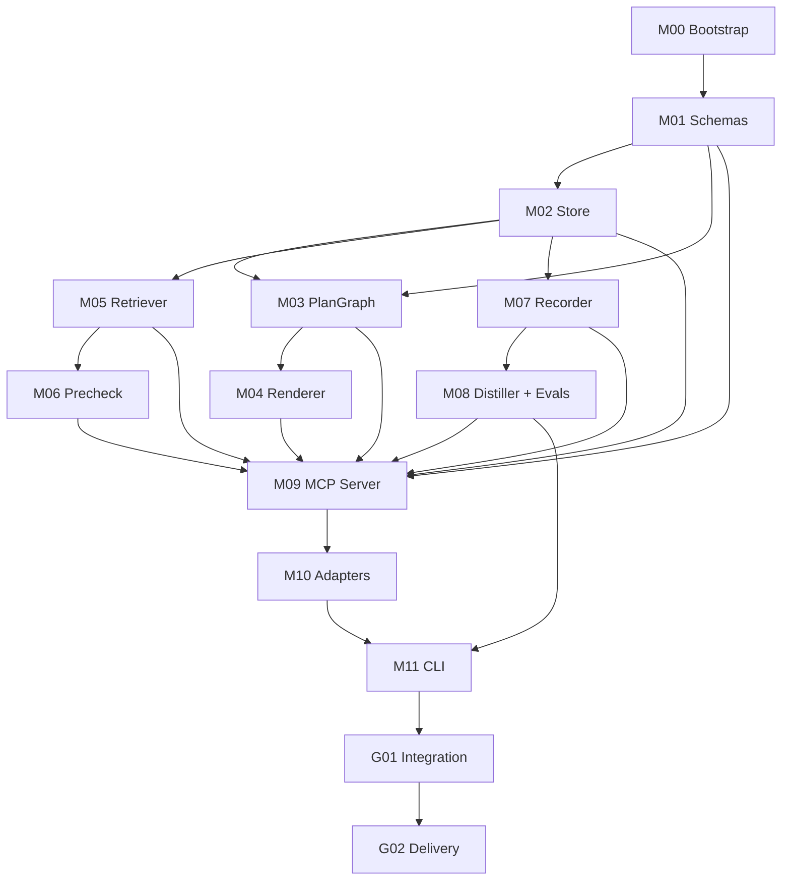

# DMC Agent Start Here — All-in-one Implementation Plan

This single file contains the same planning contracts as the zip bootstrap pack. If using the zip pack, give the agent `START_HERE.md`; if using a single file, give this file and ask it to materialize the referenced files first.


---

<!-- BEGIN FILE: START_HERE.md -->

# START HERE — Dev Memory Compiler Agent Bootstrap Plan

You are a fresh coding agent. You have no trusted memory from previous chat turns. Your only reliable inputs are the files in this bootstrap pack and the repository files you inspect yourself.

Your job is to build **Dev Memory Compiler (DMC)** as a thin local memory/context sidecar for coding agents. DMC must help future agents plan, inspect, execute, record, distill, and reuse development experience across sessions.

DMC is **not** a generic chat memory product. DMC exists to preserve development experience from codebases, hardware specs, tests, profiler/benchmark artifacts, debugging trajectories, wrong turns, and project state.

---

## 0. Non-negotiable rules

1. **State-first execution**: before doing any work, read `agent_state.json`. If it does not exist, create it from `templates/agent_state.initial.json`.
2. **Every task assumes a fresh agent**: never rely on conversation history. Read the module card and the listed context files.
3. **One claimable unit at a time**: claim one module or integration gate, complete it, validate it, write a handoff, update state.
4. **No wheel reinvention**: use uv, Pydantic, Typer, Rich, PyYAML, SQLite/FTS5, pytest, ruff, and MCP Python SDK/FastMCP. Do not implement repo graph, vector DB, graph DB, web UI, agent harness, sandbox, custom code indexer, or profiler parsers in v0.
5. **DMC is a sidecar, not a harness**: Codex/Copilot/OpenCode/Claude/Cursor remain the execution agents. DMC provides schemas, local store, PlanGraph, briefing, precheck, event logging, distillation, eval cases, and adapter files.
6. **No fake completion**: a module cannot be marked `done` unless all acceptance commands pass and an acceptance report is written.
7. **No silent test weakening**: do not remove or weaken tests to pass. If a test is wrong, explain why in the handoff and add a replacement test.
8. **No dynamic facts inside stable rules**: `AGENTS.md`, Copilot instructions, and OpenCode skills contain protocol only. Project state lives under `.dmc/state/project_state.yaml`.
9. **Evidence over prose**: every state update, skill proposal, eval case, failure mode, and benchmark claim must carry provenance fields.
10. **User maintenance cost matters**: prefer fewer modules, fewer moving parts, plain files, and local-first behavior.

---

## 1. First action for any agent

Run this exact checklist:

```text
1. Read this file: START_HERE.md.
2. Read docs/PROJECT_INDEX.md.
3. Read agent_state.json if present; otherwise create it from templates/agent_state.initial.json.
4. Determine the next claimable unit:
   - status == "ready"
   - dependencies are done
   - no unresolved blocker
5. Read the module card listed in agent_state.modules[MODULE_ID].module_doc.
6. Read every file listed under that module card's "Must-read context".
7. Implement only the required scope.
8. Run the module's acceptance commands.
9. Write reports/handoffs/<MODULE_ID>_<attempt_id>.md.
10. Update agent_state.json.
```

If there are multiple ready modules, pick the lowest module ID unless `agent_state.json` explicitly prioritizes another module.

---

## 2. Agent loop

This is the full local loop. A human should be able to give only this `START_HERE.md` to a coding agent, and the agent should know how to continue.

```pseudo
while project not delivered:
    read agent_state.json
    validate agent_state against templates/agent_state.schema.json

    if agent_state.project_status == "uninitialized":
        claim M00_BOOTSTRAP
    else:
        claim first module where:
            status in ["ready", "needs_revision"]
            dependencies are done
            blockers is empty

    if no module is claimable:
        if integration gate is ready:
            claim next integration gate
        else:
            write a blocker report and stop

    read module_doc and all must-read context files
    implement scope exactly
    run acceptance commands exactly

    if acceptance passes:
        write acceptance report
        mark module done
        unblock dependents
    else:
        write failure report
        mark module needs_revision or blocked with exact reason

    update agent_state.json atomically
```

State updates must be atomic: write to `agent_state.json.tmp`, validate it, then replace `agent_state.json`.

---

## 3. Project phases

### P0 — Documentation and scaffold

Goal: create the repo skeleton, uv environment, state files, package structure, test harness, and generated docs.

Must deliver:

```text
pyproject.toml
uv.lock
src/dmc/
tests/
.dmc/
agent_state.json
AGENTS.md
README.md
```

### V0 — Local core

Goal: make DMC usable locally without any LLM, vector DB, UI, external MCP dependency, or agent harness.

Must deliver:

```text
schemas
local store
PlanGraph validator
Mermaid/Markdown renderer
local retriever
precheck engine
event recorder
distiller/eval-case stub compiler
Typer CLI
pytest coverage for each module
```

### V0.5 — MCP and adapters

Goal: expose DMC to Codex/Copilot/OpenCode/Claude-compatible surfaces through a thin MCP server and generated adapter bundles.

Must deliver:

```text
DMC MCP server with tools/resources/prompts
Codex AGENTS.md and .codex/config.toml.template
Copilot instructions and skill folder template
OpenCode AGENTS.md, opencode.jsonc.template, agents/skills templates
```

### V1 — PlanGraph loop and learning loop

Goal: support editable execution graphs, session-to-eval compilation, failure mode/precheck compilation, and visual review.

Must deliver:

```text
PlanGraph execution readiness states
Mermaid graph renderer
session -> episode -> eval_case -> failure_mode -> skill_update_proposal
integration tests across two fake sessions
```

---

## 4. Required project architecture

```text
Codex / Copilot / OpenCode / Claude / Cursor
        |
        | MCP + AGENTS.md / skills / instructions
        v
DMC Adapter Layer
        |
        v
DMC Core
  - plan_task
  - get_briefing
  - search
  - precheck
  - record_event
  - commit_state
  - distill_session
  - propose_skill_update
        |
        v
Local Store
  - SQLite + FTS5
  - YAML/Markdown human-editable objects
  - JSONL append-only trace
  - filesystem artifacts
        |
        v
External existing tools, not reimplemented by DMC
  - Serena MCP for repo symbols/code navigation
  - GitHub MCP for issues/PRs/commits
  - Sourcegraph MCP for large/cross-repo search, optional
  - Basic Memory MCP for Markdown notes/specs, optional
```

---

## 5. Required repo layout after bootstrap

```text
.
├── START_HERE.md
├── README.md
├── AGENTS.md
├── pyproject.toml
├── uv.lock
├── agent_state.json
├── src/
│   └── dmc/
│       ├── __init__.py
│       ├── cli.py
│       ├── schemas.py
│       ├── store.py
│       ├── planner.py
│       ├── renderer.py
│       ├── retriever.py
│       ├── precheck.py
│       ├── recorder.py
│       ├── distiller.py
│       ├── evals.py
│       ├── mcp_server.py
│       └── adapters.py
├── tests/
│   ├── test_schemas.py
│   ├── test_store.py
│   ├── test_plan_graph.py
│   ├── test_renderer.py
│   ├── test_retriever.py
│   ├── test_precheck.py
│   ├── test_recorder.py
│   ├── test_distiller.py
│   ├── test_cli.py
│   └── golden/
├── .dmc/
│   ├── config.yaml
│   ├── state/
│   │   ├── project_state.yaml
│   │   └── active_task.yaml
│   ├── plans/
│   ├── memory/
│   │   ├── events.jsonl
│   │   ├── sessions/
│   │   ├── episodes/
│   │   ├── failure_modes/
│   │   └── eval_cases/
│   ├── skills/
│   │   ├── tier0/
│   │   ├── tier1/
│   │   └── tier2/
│   ├── knowledge/
│   │   ├── repo/
│   │   ├── tests/
│   │   ├── perf/
│   │   ├── hw/
│   │   └── specs/
│   ├── artifacts/
│   │   ├── index.jsonl
│   │   └── raw/
│   ├── proposals/
│   │   ├── pending/
│   │   ├── accepted/
│   │   └── rejected/
│   └── adapters/
│       ├── codex/
│       ├── copilot/
│       └── opencode/
└── reports/
    ├── handoffs/
    ├── acceptance/
    └── integration/
```

---

## 6. Implementation order

Implement modules in this order unless `agent_state.json` says otherwise:

```text
M00_BOOTSTRAP
M01_SCHEMAS
M02_STORE
M03_PLAN_GRAPH
M04_RENDERER
M05_RETRIEVER
M06_PRECHECK
M07_RECORDER
M08_DISTILLER_EVALS
M09_MCP_SERVER
M10_ADAPTERS
M11_CLI
G01_INTEGRATION_V0
G02_DELIVERY_V0
```

---

## 7. Minimal command set

After bootstrap, these commands must exist:

```bash
uv run dmc --help
uv run dmc state show
uv run dmc plan examples/sample_task.yaml --out .dmc/plans/active/plan_graph.yaml
uv run dmc graph .dmc/plans/active/plan_graph.yaml --format mermaid --out .dmc/plans/active/plan_graph.mmd
uv run dmc brief examples/sample_task.yaml --out .dmc/briefing.md
uv run dmc search "BMG occupancy low" --scope skills --scope memory
uv run dmc precheck examples/sample_action.yaml
uv run dmc record examples/sample_event.yaml
uv run dmc distill --session sess_demo
uv run dmc export-agent-bundle --target codex --out .dmc/adapters/codex
uv run pytest
uv run ruff check .
```

---

## 8. v0 quality bar

A module is not done until all are true:

```text
[ ] All inputs and outputs match its module card.
[ ] All public functions have typed signatures.
[ ] All schemas reject invalid examples.
[ ] Tests include positive and negative cases.
[ ] Acceptance commands pass from a clean checkout after `uv sync`.
[ ] No hidden network requirement except dependency installation.
[ ] No vector DB, graph DB, UI, custom repo indexer, or autonomous agent harness.
[ ] Handoff report exists and links changed files/tests.
[ ] agent_state.json updated.
```

---

## 9. Strong stop conditions

Stop and write a blocker report instead of guessing when:

```text
- Required context file is missing.
- agent_state.json is invalid and cannot be repaired from template.
- A dependency module is not done.
- A required open-source dependency is unavailable.
- Tests fail for reasons outside the module's scope.
- The requested work would require building a forbidden system in v0.
```

Do not ask the user to clarify unless the repo state truly prevents execution. Prefer writing a precise blocker report that a later agent can act on.


<!-- END FILE: START_HERE.md -->


---

<!-- BEGIN FILE: docs/PROJECT_INDEX.md -->

# Project Index — Dev Memory Compiler Bootstrap Pack

This is the index every agent must read after `START_HERE.md`.

## Core docs

| Path | Purpose | Read when |
|---|---|---|
| `START_HERE.md` | Root execution protocol | Always first |
| `docs/PROJECT_INDEX.md` | Project index and doc routing | Always second |
| `docs/AGENT_STATE_PROTOCOL.md` | State-driven agent loop | Before any implementation |
| `docs/TOOL_POLICY.md` | What to reuse and what not to build | Before any implementation |
| `docs/ACCEPTANCE_PROTOCOL.md` | Acceptance, handoff, and delivery rules | Before marking anything done |

## Phase docs

| Path | Phase | Purpose |
|---|---|---|
| `docs/v0/00_GOALS_AND_NON_GOALS.md` | V0 | Scope, success criteria, and forbidden work |
| `docs/v0/01_BOOTSTRAP_INIT.md` | P0/V0 | Init agent instructions and uv environment |
| `docs/v0/02_ARCHITECTURE.md` | V0 | Architecture and package layout |
| `docs/v0/03_MODULE_SEQUENCE.md` | V0 | Module dependency order |
| `docs/v0/04_INTEGRATION_AND_DELIVERY.md` | V0 | How modules are integrated and delivered |
| `docs/v1/00_PLAN_GRAPH_AND_LEARNING_LOOP.md` | V1 | Editable graph, eval set, and learning loop |
| `docs/v1/01_VISUALIZATION_OPTIONAL.md` | V1 | Optional graph visualization path |

## Module cards

Each module card is a contract for a separate fresh agent.

| Module | Path | Depends on |
|---|---|---|
| M00_BOOTSTRAP | `modules/M00_BOOTSTRAP.md` | none |
| M01_SCHEMAS | `modules/M01_SCHEMAS.md` | M00 |
| M02_STORE | `modules/M02_STORE.md` | M01 |
| M03_PLAN_GRAPH | `modules/M03_PLAN_GRAPH.md` | M01, M02 |
| M04_RENDERER | `modules/M04_RENDERER.md` | M01, M03 |
| M05_RETRIEVER | `modules/M05_RETRIEVER.md` | M01, M02 |
| M06_PRECHECK | `modules/M06_PRECHECK.md` | M01, M02, M05 |
| M07_RECORDER | `modules/M07_RECORDER.md` | M01, M02 |
| M08_DISTILLER_EVALS | `modules/M08_DISTILLER_EVALS.md` | M01, M02, M07 |
| M09_MCP_SERVER | `modules/M09_MCP_SERVER.md` | M01-M08 |
| M10_ADAPTERS | `modules/M10_ADAPTERS.md` | M01, M03, M04, M09 |
| M11_CLI | `modules/M11_CLI.md` | M01-M08, M10 |
| G01_INTEGRATION_V0 | `modules/G01_INTEGRATION_V0.md` | M00-M11 |
| G02_DELIVERY_V0 | `modules/G02_DELIVERY_V0.md` | G01 |

## Templates and schemas

| Path | Purpose |
|---|---|
| `templates/agent_state.initial.json` | Initial state file |
| `templates/agent_state.schema.json` | State schema |
| `templates/plan_graph.schema.json` | PlanGraph JSON schema target |
| `templates/trace_event.schema.json` | TraceEvent schema target |
| `templates/eval_case.schema.json` | EvalCase schema target |
| `templates/acceptance_report.template.md` | Required module acceptance report |
| `templates/handoff_report.template.md` | Required module handoff report |
| `templates/pyproject.toml.template` | Bootstrap pyproject reference |

## Prompts

| Path | Purpose |
|---|---|
| `prompts/MODULE_AGENT_CONTRACT.md` | Copyable prompt for a module implementation agent |
| `prompts/REVIEWER_AGENT_CONTRACT.md` | Copyable prompt for a review agent |
| `prompts/DELIVERY_AGENT_CONTRACT.md` | Copyable prompt for final delivery |

## The final generated repo must preserve this rule

The root `START_HERE.md` remains the only entrypoint. Other docs are context selected by `agent_state.json` and module cards.


<!-- END FILE: docs/PROJECT_INDEX.md -->


---

<!-- BEGIN FILE: docs/AGENT_STATE_PROTOCOL.md -->

# Agent State Protocol

Every agent is stateless except for repository files. The state file is the coordination mechanism.

## Required state file

Path:

```text
agent_state.json
```

If missing, create it from:

```text
templates/agent_state.initial.json
```

Then validate against:

```text
templates/agent_state.schema.json
```

## Claiming work

To claim a module:

1. Read `agent_state.json`.
2. Find a module with `status` equal to `ready` or `needs_revision`.
3. Confirm all dependencies have status `done`.
4. Confirm `blockers` is empty.
5. Set:

```json
{
  "status": "in_progress",
  "active_agent": "<agent_label>",
  "attempt_id": "attempt_<timestamp_or_short_uuid>",
  "started_at": "<ISO-8601 timestamp>"
}
```

6. Write atomically.

If another agent already claimed the module, pick another ready module or stop with a blocker report.

## Updating work

When acceptance passes:

```json
{
  "status": "done",
  "completed_at": "<ISO-8601 timestamp>",
  "acceptance_report": "reports/acceptance/<MODULE_ID>_<attempt_id>.md",
  "handoff_report": "reports/handoffs/<MODULE_ID>_<attempt_id>.md"
}
```

When acceptance fails:

```json
{
  "status": "needs_revision",
  "last_failure": {
    "summary": "exact failure",
    "commands": ["uv run pytest ..."],
    "logs": ["reports/handoffs/..."]
  }
}
```

When blocked:

```json
{
  "status": "blocked",
  "blockers": [
    {
      "summary": "missing dependency or ambiguous requirement",
      "required_action": "what a later agent or human must do",
      "evidence": ["file path", "command output", "test name"]
    }
  ]
}
```

## Context selection

Agents must read exactly these classes of files before editing:

```text
1. START_HERE.md
2. docs/PROJECT_INDEX.md
3. docs/AGENT_STATE_PROTOCOL.md
4. docs/TOOL_POLICY.md
5. the active phase doc
6. the module card
7. any module-specific context files listed under "Must-read context"
8. dependency handoff reports if the module depends on completed modules
```

The module card may list source files that do not exist yet. Missing source files are expected for implementation modules. Missing docs/templates are blockers.

## Loop termination

A single agent may keep looping only if the caller explicitly wants a full local run. Otherwise, complete one module and stop with a clean handoff.

For full-run mode:

```text
After finishing a module, re-read agent_state.json and choose the next ready module.
Never continue if an integration gate fails.
Never skip review gates.
```


<!-- END FILE: docs/AGENT_STATE_PROTOCOL.md -->


---

<!-- BEGIN FILE: docs/TOOL_POLICY.md -->

# Tool Policy — Reuse First, Minimal Code Only

DMC must minimize maintenance burden. It should be a thin local sidecar with stable schemas and contracts.

## Required stack

Use these unless impossible:

```text
Python: 3.11 or 3.12
Project/package manager: uv
Schemas: Pydantic
CLI: Typer + Rich
YAML: PyYAML
Storage: SQLite from stdlib + SQLite FTS5 + filesystem
Event log: JSONL append-only files
Tests: pytest
Lint: ruff
MCP: MCP Python SDK or FastMCP
Graph rendering: Mermaid text output
```

## Recommended external tools, not reimplemented by DMC

```text
Serena MCP       -> repo symbols, references, file/code structure
GitHub MCP       -> issues, PRs, commits, repo metadata
Sourcegraph MCP  -> large repo / multi-repo / cross-repo search, optional
Basic Memory MCP -> Markdown notes/spec/project knowledge, optional
Codex skills     -> task-specific Codex workflows, optional
Copilot skills   -> task-specific Copilot workflows, optional
OpenCode skills  -> SKILL.md-based reusable OpenCode workflows, optional
```

## Forbidden in V0

Do not implement:

```text
custom repo graph
custom symbol indexer
custom call graph
custom vector database
graph database
RAG platform
web dashboard
full UI debugger
full agent harness
sandbox runner
multi-agent orchestrator
automatic profiler parser framework
cloud sync
training pipeline
```

## Allowed later, not V0

```text
embedding retrieval
interactive HTML graph viewer
Sourcegraph-specific adapter helpers
Basic Memory sync helper
ProjectMem import/export helper
LLM-assisted distillation
agent-specific plugins beyond file bundle generation
```

## Dependency discipline

Before adding a dependency:

1. Check whether stdlib is sufficient.
2. Check whether an existing listed dependency already covers it.
3. Add only if it removes more code than it adds.
4. Record the reason in the module handoff.

Do not add heavy frameworks for a single helper function.


<!-- END FILE: docs/TOOL_POLICY.md -->


---

<!-- BEGIN FILE: docs/ACCEPTANCE_PROTOCOL.md -->

# Acceptance Protocol

A module is complete only when implementation, tests, docs, state, and handoff are complete.

## Required report files

For each module attempt:

```text
reports/handoffs/<MODULE_ID>_<attempt_id>.md
reports/acceptance/<MODULE_ID>_<attempt_id>.md
```

Use templates:

```text
templates/handoff_report.template.md
templates/acceptance_report.template.md
```

## Minimum acceptance commands

Each module may add its own commands, but these must pass by G01 integration:

```bash
uv sync
uv run pytest
uv run ruff check .
uv run dmc --help
```

## Module-level acceptance

A module acceptance report must include:

```text
- module id
- attempt id
- files changed
- public APIs implemented
- tests added/changed
- commands run
- command results
- known limitations
- dependency changes
- no-forbidden-work checklist
```

## No fake completion checklist

Before marking done, verify:

```text
[ ] No placeholder pass-through implementation.
[ ] No TODO used as substitute for required logic.
[ ] No test deleted merely to pass.
[ ] No acceptance command skipped.
[ ] No hidden network or local machine dependency.
[ ] No forbidden system implemented.
[ ] Public functions have deterministic behavior for tested inputs.
[ ] Schema validation fails on invalid examples.
[ ] Errors are explicit and actionable.
```

## Integration gates

Integration gates are separate modules:

```text
G01_INTEGRATION_V0
G02_DELIVERY_V0
```

No delivery is allowed before G01 passes.


<!-- END FILE: docs/ACCEPTANCE_PROTOCOL.md -->


---

<!-- BEGIN FILE: docs/v0/00_GOALS_AND_NON_GOALS.md -->

# V0 Goals and Non-goals

## Mission

Build a local-first Dev Memory Compiler sidecar that lets coding agents:

```text
start task -> plan task -> get briefing -> inspect context -> execute -> record events -> precheck risky actions -> commit project state -> distill session -> produce eval cases and skill proposals -> recall next time
```

## V0 goals

```text
1. Define durable schemas for state, skills, artifacts, trace events, PlanGraph, eval cases, and proposals.
2. Store all data locally using plain files plus SQLite/FTS5.
3. Generate deterministic task plans and briefings without requiring an LLM.
4. Render PlanGraph to Mermaid and Markdown.
5. Support local search over state, skills, memory, and artifacts.
6. Warn/block repeated bad actions using deterministic precheck rules.
7. Record action-level trace events and artifacts.
8. Distill sessions into episode/eval/proposal stubs with provenance.
9. Expose a minimal CLI.
10. Generate adapter bundles for Codex/Copilot/OpenCode.
```

## Non-goals

```text
- Solve tasks autonomously.
- Replace Codex/Copilot/OpenCode.
- Parse every benchmark/profiler format.
- Build a repo graph or code indexer.
- Build a vector search platform.
- Build a web UI.
- Train or fine-tune models.
- Store private credentials.
```

## Success definition

V0 succeeds if a fresh agent can run:

```bash
uv run dmc plan examples/sample_task.yaml --out .dmc/plans/active/plan_graph.yaml
uv run dmc graph .dmc/plans/active/plan_graph.yaml --format mermaid --out .dmc/plans/active/plan_graph.mmd
uv run dmc brief examples/sample_task.yaml --out .dmc/briefing.md
uv run dmc record examples/sample_event.yaml
uv run dmc distill --session sess_demo
uv run dmc export-agent-bundle --target codex --out .dmc/adapters/codex
uv run pytest
```

and the outputs contain provenance, readable IDs, and no hardcoded absolute paths.


<!-- END FILE: docs/v0/00_GOALS_AND_NON_GOALS.md -->


---

<!-- BEGIN FILE: docs/v0/01_BOOTSTRAP_INIT.md -->

# V0 Bootstrap Init Agent

This doc is for M00_BOOTSTRAP.

## Required commands

Bootstrap must use uv.

Recommended command sequence:

```bash
uv init --package dmc
uv add pydantic pydantic-settings pyyaml typer rich
uv add --dev pytest ruff
# Add one MCP dependency only in M09, not during bootstrap unless module plan says otherwise.
mkdir -p src/dmc tests tests/golden .dmc/state .dmc/plans .dmc/memory .dmc/skills/tier0 .dmc/skills/tier1 .dmc/skills/tier2 .dmc/knowledge .dmc/artifacts/raw .dmc/proposals/pending .dmc/proposals/accepted .dmc/proposals/rejected reports/handoffs reports/acceptance reports/integration examples
```

If `uv init --package dmc` creates a different layout, adapt without changing the required final layout.

## Required generated files

```text
pyproject.toml
src/dmc/__init__.py
src/dmc/cli.py
README.md
AGENTS.md
.dmc/config.yaml
.dmc/state/project_state.yaml
.dmc/state/active_task.yaml
.dmc/memory/events.jsonl
.dmc/artifacts/index.jsonl
examples/sample_task.yaml
examples/sample_action.yaml
examples/sample_event.yaml
agent_state.json
```

## Initial CLI behavior

`uv run dmc --help` must work even before other modules are implemented.

It can show placeholder commands, but commands must fail with clear `NotImplementedError` or user-facing error until their module is complete.

## Acceptance

```bash
uv sync
uv run dmc --help
uv run pytest
uv run ruff check .
```

`uv run pytest` must pass with at least one smoke test.


<!-- END FILE: docs/v0/01_BOOTSTRAP_INIT.md -->


---

<!-- BEGIN FILE: docs/v0/02_ARCHITECTURE.md -->

# V0 Architecture

## Layers

```text
src/dmc/schemas.py      -> typed contracts
src/dmc/store.py        -> local files + SQLite/FTS5
src/dmc/planner.py      -> PlanGraph creation/validation/readiness
src/dmc/renderer.py     -> Markdown and Mermaid rendering
src/dmc/retriever.py    -> local search over DMC objects
src/dmc/precheck.py     -> deterministic gates/warnings
src/dmc/recorder.py     -> action-level event and artifact recording
src/dmc/distiller.py    -> session -> episode/failure/proposal/eval stubs
src/dmc/evals.py        -> eval-case helpers and metrics
src/dmc/mcp_server.py   -> MCP tools/resources/prompts
src/dmc/adapters.py     -> Codex/Copilot/OpenCode bundle generation
src/dmc/cli.py          -> Typer CLI
```

## Data object boundaries

```text
ProjectState: where the project is now.
Tier0Policy: always-on evidence/reproducibility rules.
Tier1Workflow: stable task workflow.
Tier2Atom: executable atomic action/tool pattern.
KnowledgeRef: fact/spec/doc/code reference.
TraceEvent: action-level event from a session.
ArtifactCard: raw artifact summary and URI.
EpisodeCard: what happened in a session.
FailureMode: repeatable wrong turn and trigger.
PrecheckRule: deterministic warning/block rule.
SkillUpdateProposal: pending change to workflow/atom/knowledge.
EvalCase: test-set-like record produced from a session.
PlanGraph: editable execution graph.
```

## URI convention

Use readable local URIs:

```text
dmc://project_state/current
dmc://skill/tier1/<id>
dmc://skill/tier2/<id>
dmc://knowledge/<path>
dmc://event/<id>
dmc://artifact/<id>
dmc://episode/<id>
dmc://failure_mode/<id>
dmc://proposal/<id>
dmc://eval_case/<id>
plan://<id>
session://<id>
```

## Error handling

All public functions should return typed results or raise explicit DMC exceptions:

```text
DMCValidationError
DMCNotFoundError
DMCBlockedError
DMCStorageError
```

No bare `Exception` for expected failures.


<!-- END FILE: docs/v0/02_ARCHITECTURE.md -->


---

<!-- BEGIN FILE: docs/v0/03_MODULE_SEQUENCE.md -->

# V0 Module Sequence

## Dependency graph



## Parallelism

After M01 and M02 are done, M03/M05/M07 can be done by separate agents. M09 must wait until M01-M08 are done.

## Revision policy

If a downstream module discovers a schema gap, it must:

1. Write a blocker or revision request against M01.
2. Add a proposed schema diff in its handoff.
3. Not patch schemas ad hoc without tests.


<!-- END FILE: docs/v0/03_MODULE_SEQUENCE.md -->


---

<!-- BEGIN FILE: docs/v0/04_INTEGRATION_AND_DELIVERY.md -->

# V0 Integration and Delivery

## G01 Integration goals

The integration agent must verify the whole loop:

```text
sample task -> plan graph -> graph render -> briefing -> precheck -> record event -> distill session -> eval case -> adapter bundle
```

## Required integration commands

```bash
uv sync
uv run pytest
uv run ruff check .
uv run dmc --help
uv run dmc plan examples/sample_task.yaml --out .dmc/plans/active/plan_graph.yaml
uv run dmc graph .dmc/plans/active/plan_graph.yaml --format mermaid --out .dmc/plans/active/plan_graph.mmd
uv run dmc brief examples/sample_task.yaml --out .dmc/briefing.md
uv run dmc precheck examples/sample_action.yaml --out reports/integration/precheck_result.json
uv run dmc record examples/sample_event.yaml
uv run dmc distill --session sess_demo
uv run dmc export-agent-bundle --target codex --out .dmc/adapters/codex
uv run dmc export-agent-bundle --target copilot --out .dmc/adapters/copilot
uv run dmc export-agent-bundle --target opencode --out .dmc/adapters/opencode
```

## Required integration artifacts

```text
reports/integration/v0_integration_report.md
.dmc/plans/active/plan_graph.yaml
.dmc/plans/active/plan_graph.mmd
.dmc/briefing.md
.dmc/memory/events.jsonl
.dmc/memory/eval_cases/*.yaml or *.json
.dmc/proposals/pending/*
.dmc/adapters/codex/*
.dmc/adapters/copilot/*
.dmc/adapters/opencode/*
```

## G02 delivery goals

The delivery agent must package the repo state and write:

```text
reports/integration/v0_delivery_report.md
README.md updated with quickstart
CHANGELOG.md with V0 notes
```

No delivery if G01 has unresolved failures.


<!-- END FILE: docs/v0/04_INTEGRATION_AND_DELIVERY.md -->


---

<!-- BEGIN FILE: docs/v1/00_PLAN_GRAPH_AND_LEARNING_LOOP.md -->

# V1 PlanGraph and Learning Loop

V1 adds the full loop that the user eventually wants: inspectable graphs, edited graphs, execution traces, and session-derived eval cases.

## V1 loop

```text
TaskRequest
  -> dmc_plan_task
  -> PlanGraph YAML
  -> Mermaid/HTML inspection
  -> human or agent edits graph
  -> agent executes graph nodes
  -> dmc_record_event for each meaningful action
  -> dmc_precheck before risky actions
  -> dmc_commit_state at checkpoints
  -> dmc_distill_session at end
  -> Episode + FailureMode + EvalCase + SkillUpdateProposal
  -> next task retrieves workflows/atoms/pitfalls/eval cases
```

## V1 new objects

```text
PlanGraphVersion
PlanGraphEdit
ExecutionNodeState
UsefulMemoryLabel
WrongTurnLabel
RetrievalEvalCase
GraphReviewReport
```

## V1 acceptance idea

Create two fake sessions:

1. Session A records a wrong turn and produces a failure mode.
2. Session B starts with a similar task and precheck warns before repeating that wrong turn.

V1 passes if the warning is deterministic and provenance links back to Session A.


<!-- END FILE: docs/v1/00_PLAN_GRAPH_AND_LEARNING_LOOP.md -->


---

<!-- BEGIN FILE: docs/v1/01_VISUALIZATION_OPTIONAL.md -->

# Optional Visualization Path

Do not build an interactive UI in V0.

## V0 visualization

Generate Mermaid text:

```bash
uv run dmc graph .dmc/plans/active/plan_graph.yaml --format mermaid --out .dmc/plans/active/plan_graph.mmd
```

## V1 visualization

Optional static HTML can be added later using:

```text
Mermaid embedded HTML
no frontend framework
no server required
```

## V1.5 visualization

Only after the core loop proves useful:

```text
click node -> show context refs
edit node -> update PlanGraph YAML
show evidence gates
show session trace timeline
```

This must remain optional. The source of truth is always PlanGraph YAML/JSON, not the UI.


<!-- END FILE: docs/v1/01_VISUALIZATION_OPTIONAL.md -->


---

<!-- BEGIN FILE: modules/G01_INTEGRATION_V0.md -->

# G01_INTEGRATION_V0 — End-to-end V0 integration gate

## Agent contract

You are a fresh module implementation agent. Do not rely on prior chat. Read the state file, claim this module, implement only this module, run acceptance, write handoff, update state.

## Dependencies

- M00_BOOTSTRAP
- M01_SCHEMAS
- M02_STORE
- M03_PLAN_GRAPH
- M04_RENDERER
- M05_RETRIEVER
- M06_PRECHECK
- M07_RECORDER
- M08_DISTILLER_EVALS
- M09_MCP_SERVER
- M10_ADAPTERS
- M11_CLI

## Must-read context

- `START_HERE.md`
- `docs/PROJECT_INDEX.md`
- `docs/ACCEPTANCE_PROTOCOL.md`
- `docs/v0/04_INTEGRATION_AND_DELIVERY.md`
- `all reports/handoffs/*.md`
- `all reports/acceptance/*.md`

## Scope

Run the whole V0 loop from sample task to adapter bundle. Fix only integration glue; do not redesign modules unless a blocker report requires revision.

## Required public API / inputs / outputs

### Required integration scenario

```text
sample_task.yaml -> plan_graph.yaml -> plan_graph.mmd -> briefing.md -> precheck_result.json -> events.jsonl -> eval_case -> proposal -> codex/copilot/opencode bundles
```

### Required report

```text
reports/integration/v0_integration_report.md
```

## Strong acceptance commands

- `uv sync`
- `uv run pytest`
- `uv run ruff check .`
- `uv run dmc --help`
- `uv run dmc plan examples/sample_task.yaml --out .dmc/plans/active/plan_graph.yaml`
- `uv run dmc graph .dmc/plans/active/plan_graph.yaml --format mermaid --out .dmc/plans/active/plan_graph.mmd`
- `uv run dmc brief examples/sample_task.yaml --out .dmc/briefing.md`
- `uv run dmc precheck examples/sample_action.yaml --out reports/integration/precheck_result.json`
- `uv run dmc record examples/sample_event.yaml`
- `uv run dmc distill --session sess_demo`
- `uv run dmc export-agent-bundle --target codex --out .dmc/adapters/codex`
- `uv run dmc export-agent-bundle --target copilot --out .dmc/adapters/copilot`
- `uv run dmc export-agent-bundle --target opencode --out .dmc/adapters/opencode`

## Module-specific forbidden shortcuts

- Do not skip any module tests.
- Do not mark integration passed if adapter bundles are missing.

## Required handoff

Write:

```text
reports/handoffs/G01_INTEGRATION_V0_<attempt_id>.md
reports/acceptance/G01_INTEGRATION_V0_<attempt_id>.md
```

Update `agent_state.json` with status, reports, changed files, and blockers if any.


<!-- END FILE: modules/G01_INTEGRATION_V0.md -->


---

<!-- BEGIN FILE: modules/G02_DELIVERY_V0.md -->

# G02_DELIVERY_V0 — Final V0 delivery packaging

## Agent contract

You are a fresh module implementation agent. Do not rely on prior chat. Read the state file, claim this module, implement only this module, run acceptance, write handoff, update state.

## Dependencies

- G01_INTEGRATION_V0

## Must-read context

- `START_HERE.md`
- `docs/PROJECT_INDEX.md`
- `docs/ACCEPTANCE_PROTOCOL.md`
- `docs/v0/04_INTEGRATION_AND_DELIVERY.md`
- `reports/integration/v0_integration_report.md`

## Scope

Prepare final delivery docs and sanity checks. This module does not add features.

## Required public API / inputs / outputs

### Required outputs

```text
README.md with quickstart
CHANGELOG.md with V0 summary
reports/integration/v0_delivery_report.md
agent_state.json project_status = delivered_v0
```

### Delivery report must include

```text
- commands run
- artifact list
- known limitations
- next phase recommendations
- confirmation that forbidden V0 systems were not implemented
```

## Strong acceptance commands

- `uv sync`
- `uv run pytest`
- `uv run ruff check .`
- `uv run dmc --help`

## Module-specific forbidden shortcuts

- Do not add new capabilities during delivery.
- Do not hide known limitations.

## Required handoff

Write:

```text
reports/handoffs/G02_DELIVERY_V0_<attempt_id>.md
reports/acceptance/G02_DELIVERY_V0_<attempt_id>.md
```

Update `agent_state.json` with status, reports, changed files, and blockers if any.


<!-- END FILE: modules/G02_DELIVERY_V0.md -->


---

<!-- BEGIN FILE: modules/M00_BOOTSTRAP.md -->

# M00_BOOTSTRAP — Initialize repo, uv environment, skeleton, and DMC directories

## Agent contract

You are a fresh module implementation agent. Do not rely on prior chat. Read the state file, claim this module, implement only this module, run acceptance, write handoff, update state.

## Dependencies

- none

## Must-read context

- `START_HERE.md`
- `docs/PROJECT_INDEX.md`
- `docs/AGENT_STATE_PROTOCOL.md`
- `docs/TOOL_POLICY.md`
- `docs/ACCEPTANCE_PROTOCOL.md`
- `docs/v0/00_GOALS_AND_NON_GOALS.md`
- `docs/v0/01_BOOTSTRAP_INIT.md`
- `templates/pyproject.toml.template`
- `templates/agent_state.initial.json`

## Scope

Create the project skeleton. Use uv. Create package layout, tests layout, `.dmc` layout, examples, initial state files, `README.md`, `AGENTS.md`, and a smoke-testable Typer CLI entry point.

Do not implement deep module logic. Only create stubs with explicit errors where later modules own the logic.

## Required public API / inputs / outputs

### Inputs

```text
- bootstrap pack files
- current working directory
```

### Outputs

```text
- initialized uv project
- pyproject.toml with dmc console script
- src/dmc package
- tests smoke test
- .dmc directory tree
- examples/sample_task.yaml
- examples/sample_action.yaml
- examples/sample_event.yaml
- agent_state.json
```

### Required CLI surface

```python
# src/dmc/cli.py
app = typer.Typer()
def main() -> None: ...
```

`uv run dmc --help` must not crash.

## Strong acceptance commands

- `uv sync`
- `uv run dmc --help`
- `uv run pytest`
- `uv run ruff check .`

## Module-specific forbidden shortcuts

- Do not add MCP dependency yet unless absolutely required by generated CLI smoke test.
- Do not implement schema/store/planner logic beyond stubs.

## Required handoff

Write:

```text
reports/handoffs/M00_BOOTSTRAP_<attempt_id>.md
reports/acceptance/M00_BOOTSTRAP_<attempt_id>.md
```

Update `agent_state.json` with status, reports, changed files, and blockers if any.


<!-- END FILE: modules/M00_BOOTSTRAP.md -->


---

<!-- BEGIN FILE: modules/M01_SCHEMAS.md -->

# M01_SCHEMAS — Define all durable Pydantic schemas

## Agent contract

You are a fresh module implementation agent. Do not rely on prior chat. Read the state file, claim this module, implement only this module, run acceptance, write handoff, update state.

## Dependencies

- M00_BOOTSTRAP

## Must-read context

- `START_HERE.md`
- `docs/PROJECT_INDEX.md`
- `docs/AGENT_STATE_PROTOCOL.md`
- `docs/v0/02_ARCHITECTURE.md`
- `templates/plan_graph.schema.json`
- `templates/trace_event.schema.json`
- `templates/eval_case.schema.json`
- `modules/M01_SCHEMAS.md`

## Scope

Implement `src/dmc/schemas.py`. This is the contract module. Other modules must import these schemas rather than defining their own data shapes.

Export JSON schemas under `.dmc/generated_schemas/` or `schemas/` via a CLI/helper if simple.

## Required public API / inputs / outputs

### Required models

```python
class Provenance(BaseModel): ...
class EvidenceRef(BaseModel): ...
class TaskRequest(BaseModel): ...
class ProjectState(BaseModel): ...
class SkillCard(BaseModel): ...
class Tier0Policy(BaseModel): ...
class Tier1Workflow(BaseModel): ...
class Tier2Atom(BaseModel): ...
class KnowledgeRef(BaseModel): ...
class ArtifactCard(BaseModel): ...
class TraceEvent(BaseModel): ...
class PlanNode(BaseModel): ...
class PlanGraph(BaseModel): ...
class SearchRequest(BaseModel): ...
class SearchResult(BaseModel): ...
class PrecheckRequest(BaseModel): ...
class PrecheckResult(BaseModel): ...
class EpisodeCard(BaseModel): ...
class FailureMode(BaseModel): ...
class SkillUpdateProposal(BaseModel): ...
class EvalCase(BaseModel): ...
class AgentState(BaseModel): ...
```

### Required validation rules

```text
- IDs are non-empty slug-like strings.
- URIs use known prefixes where applicable.
- PlanNode dependencies reference existing nodes.
- TraceEvent has session_id, event_id, phase, action.kind, and outcome.
- Evidence-bearing objects require provenance list; empty provenance is invalid for final memory objects.
- EvalCase must include task, plan refs, outcome, labels, and provenance.
```

### Outputs

```text
- src/dmc/schemas.py
- tests/test_schemas.py
- generated schema files or tests validating model_json_schema()
```

## Strong acceptance commands

- `uv run pytest tests/test_schemas.py`
- `uv run pytest`
- `uv run ruff check .`

## Module-specific forbidden shortcuts

- Do not define duplicate dataclasses in other files.
- Do not silently coerce invalid objects into valid objects.

## Required handoff

Write:

```text
reports/handoffs/M01_SCHEMAS_<attempt_id>.md
reports/acceptance/M01_SCHEMAS_<attempt_id>.md
```

Update `agent_state.json` with status, reports, changed files, and blockers if any.


<!-- END FILE: modules/M01_SCHEMAS.md -->


---

<!-- BEGIN FILE: modules/M02_STORE.md -->

# M02_STORE — Local file + SQLite/FTS5 store

## Agent contract

You are a fresh module implementation agent. Do not rely on prior chat. Read the state file, claim this module, implement only this module, run acceptance, write handoff, update state.

## Dependencies

- M00_BOOTSTRAP
- M01_SCHEMAS

## Must-read context

- `START_HERE.md`
- `docs/PROJECT_INDEX.md`
- `docs/TOOL_POLICY.md`
- `docs/v0/02_ARCHITECTURE.md`
- `modules/M02_STORE.md`
- `reports/handoffs/M01_SCHEMAS_<latest>.md if present`

## Scope

Implement a local-first store. It must use plain files as source of truth for human-editable objects and SQLite/FTS5 as an index/cache. It must work in temporary directories for tests.

## Required public API / inputs / outputs

### Required public API

```python
class DMCStore:
    def __init__(self, root: Path) -> None: ...
    def initialize(self) -> None: ...
    def append_event(self, event: TraceEvent) -> str: ...
    def list_events(self, session_id: str | None = None) -> list[TraceEvent]: ...
    def write_object(self, kind: str, object_id: str, data: BaseModel | dict, *, ext: str = "yaml") -> str: ...
    def read_object(self, uri: str) -> dict: ...
    def upsert_project_state(self, state: ProjectState) -> int: ...
    def get_project_state(self) -> ProjectState: ...
    def save_artifact_card(self, card: ArtifactCard) -> str: ...
    def search_text(self, query: str, scopes: list[str], limit: int = 10) -> list[SearchResult]: ...
```

### Inputs

```text
root path, typed schema objects, text query
```

### Outputs

```text
local URI strings, typed objects, search results, SQLite index rows
```

### Storage requirements

```text
.dmc/memory/events.jsonl is append-only.
.dmc/artifacts/index.jsonl is append-only.
YAML/Markdown object files remain human-readable.
SQLite can be rebuilt from files.
```

## Strong acceptance commands

- `uv run pytest tests/test_store.py`
- `uv run pytest`
- `uv run ruff check .`

## Module-specific forbidden shortcuts

- Do not make SQLite the only source of truth.
- Do not add external DB dependencies.
- Do not add vector DB.

## Required handoff

Write:

```text
reports/handoffs/M02_STORE_<attempt_id>.md
reports/acceptance/M02_STORE_<attempt_id>.md
```

Update `agent_state.json` with status, reports, changed files, and blockers if any.


<!-- END FILE: modules/M02_STORE.md -->


---

<!-- BEGIN FILE: modules/M03_PLAN_GRAPH.md -->

# M03_PLAN_GRAPH — PlanGraph creation, validation, and readiness

## Agent contract

You are a fresh module implementation agent. Do not rely on prior chat. Read the state file, claim this module, implement only this module, run acceptance, write handoff, update state.

## Dependencies

- M00_BOOTSTRAP
- M01_SCHEMAS
- M02_STORE

## Must-read context

- `START_HERE.md`
- `docs/PROJECT_INDEX.md`
- `docs/v0/02_ARCHITECTURE.md`
- `docs/v1/00_PLAN_GRAPH_AND_LEARNING_LOOP.md`
- `modules/M03_PLAN_GRAPH.md`
- `reports/handoffs/M01_SCHEMAS_<latest>.md`
- `reports/handoffs/M02_STORE_<latest>.md`

## Scope

Implement deterministic PlanGraph logic. V0 planning can be template/rule-based. No LLM required.

## Required public API / inputs / outputs

### Required public API

```python
def validate_plan_graph(graph: PlanGraph) -> ValidationReport: ...
def topological_nodes(graph: PlanGraph) -> list[PlanNode]: ...
def next_ready_nodes(graph: PlanGraph, completed_node_ids: set[str]) -> list[PlanNode]: ...
def plan_task(request: TaskRequest, store: DMCStore | None = None) -> PlanGraph: ...
def save_plan_graph(graph: PlanGraph, path: Path) -> None: ...
def load_plan_graph(path: Path) -> PlanGraph: ...
```

### Inputs

```text
TaskRequest, optional store/project state, PlanGraph YAML/JSON
```

### Outputs

```text
validated PlanGraph, ordered nodes, ready nodes, saved YAML/JSON
```

### Required node types

```text
brief, inspect, plan, edit, test, benchmark, profile, review, decide, distill
```

### Validation requirements

```text
- no duplicate node IDs
- all dependencies exist
- graph has no cycles
- required node fields are non-empty
- evidence gates are valid schema objects
- human_review is explicit true/false
```

## Strong acceptance commands

- `uv run pytest tests/test_plan_graph.py`
- `uv run pytest`
- `uv run ruff check .`

## Module-specific forbidden shortcuts

- Do not call an LLM.
- Do not execute plan nodes.
- Do not build an orchestrator.

## Required handoff

Write:

```text
reports/handoffs/M03_PLAN_GRAPH_<attempt_id>.md
reports/acceptance/M03_PLAN_GRAPH_<attempt_id>.md
```

Update `agent_state.json` with status, reports, changed files, and blockers if any.


<!-- END FILE: modules/M03_PLAN_GRAPH.md -->


---

<!-- BEGIN FILE: modules/M04_RENDERER.md -->

# M04_RENDERER — Render PlanGraph and briefing to Markdown/Mermaid

## Agent contract

You are a fresh module implementation agent. Do not rely on prior chat. Read the state file, claim this module, implement only this module, run acceptance, write handoff, update state.

## Dependencies

- M01_SCHEMAS
- M03_PLAN_GRAPH

## Must-read context

- `START_HERE.md`
- `docs/PROJECT_INDEX.md`
- `docs/v1/01_VISUALIZATION_OPTIONAL.md`
- `modules/M04_RENDERER.md`
- `reports/handoffs/M03_PLAN_GRAPH_<latest>.md`

## Scope

Implement pure rendering functions. V0 visualization is Mermaid text and Markdown only.

## Required public API / inputs / outputs

### Required public API

```python
def render_plan_mermaid(graph: PlanGraph) -> str: ...
def render_plan_markdown(graph: PlanGraph) -> str: ...
def render_briefing(request: TaskRequest, graph: PlanGraph, context: list[SearchResult] | None = None) -> str: ...
def write_rendered(text: str, path: Path) -> None: ...
```

### Inputs

```text
PlanGraph, TaskRequest, SearchResult list
```

### Outputs

```text
Mermaid flowchart text, Markdown briefing text
```

### Rendering requirements

```text
- Mermaid output starts with flowchart TD or flowchart LR.
- Node labels include node id and type.
- Human review gates are visible.
- Evidence gates are visible.
- Markdown briefing includes selected workflows, atoms, knowledge refs, pitfalls, open questions, next actions.
```

## Strong acceptance commands

- `uv run pytest tests/test_renderer.py`
- `uv run pytest`
- `uv run ruff check .`

## Module-specific forbidden shortcuts

- Do not build HTML UI in V0.
- Do not import frontend frameworks.

## Required handoff

Write:

```text
reports/handoffs/M04_RENDERER_<attempt_id>.md
reports/acceptance/M04_RENDERER_<attempt_id>.md
```

Update `agent_state.json` with status, reports, changed files, and blockers if any.


<!-- END FILE: modules/M04_RENDERER.md -->


---

<!-- BEGIN FILE: modules/M05_RETRIEVER.md -->

# M05_RETRIEVER — Local retrieval over DMC objects

## Agent contract

You are a fresh module implementation agent. Do not rely on prior chat. Read the state file, claim this module, implement only this module, run acceptance, write handoff, update state.

## Dependencies

- M01_SCHEMAS
- M02_STORE

## Must-read context

- `START_HERE.md`
- `docs/PROJECT_INDEX.md`
- `docs/TOOL_POLICY.md`
- `modules/M05_RETRIEVER.md`
- `reports/handoffs/M02_STORE_<latest>.md`

## Scope

Implement local retrieval over DMC-owned files and indexes. This is not repo search. Repo/code search belongs to Serena/GitHub/Sourcegraph/Basic Memory adapters and instructions.

## Required public API / inputs / outputs

### Required public API

```python
def search(request: SearchRequest, store: DMCStore) -> list[SearchResult]: ...
def rank_results(query: str, candidates: list[SearchResult]) -> list[SearchResult]: ...
def build_context_pack(results: list[SearchResult], budget_tokens: int) -> str: ...
```

### Inputs

```text
SearchRequest(query, scopes, filters, limit, budget_tokens)
```

### Outputs

```text
ranked SearchResult list, compact context pack Markdown
```

### Search scopes

```text
project_state, skills, knowledge, artifacts, episodes, failure_modes, eval_cases, proposals
```

### Ranking requirements

```text
- exact ID/path match ranks high
- scope/filter match ranks high
- text match uses SQLite FTS5 or simple fallback
- result explains why relevant
- result carries provenance if source has it
```

## Strong acceptance commands

- `uv run pytest tests/test_retriever.py`
- `uv run pytest`
- `uv run ruff check .`

## Module-specific forbidden shortcuts

- Do not implement repo search.
- Do not add embeddings/vector DB.
- Do not index arbitrary source code in V0.

## Required handoff

Write:

```text
reports/handoffs/M05_RETRIEVER_<attempt_id>.md
reports/acceptance/M05_RETRIEVER_<attempt_id>.md
```

Update `agent_state.json` with status, reports, changed files, and blockers if any.


<!-- END FILE: modules/M05_RETRIEVER.md -->


---

<!-- BEGIN FILE: modules/M06_PRECHECK.md -->

# M06_PRECHECK — Deterministic pre-action gates and warnings

## Agent contract

You are a fresh module implementation agent. Do not rely on prior chat. Read the state file, claim this module, implement only this module, run acceptance, write handoff, update state.

## Dependencies

- M01_SCHEMAS
- M02_STORE
- M05_RETRIEVER

## Must-read context

- `START_HERE.md`
- `docs/PROJECT_INDEX.md`
- `docs/v0/02_ARCHITECTURE.md`
- `modules/M06_PRECHECK.md`
- `reports/handoffs/M05_RETRIEVER_<latest>.md`

## Scope

Implement deterministic precheck logic. It warns or blocks before repeated bad actions, risky edits, or missing evidence.

## Required public API / inputs / outputs

### Required public API

```python
def precheck(request: PrecheckRequest, store: DMCStore) -> PrecheckResult: ...
def load_precheck_rules(store: DMCStore) -> list[PrecheckRule]: ...
def match_failure_modes(request: PrecheckRequest, store: DMCStore) -> list[FailureMode]: ...
```

### Inputs

```text
PrecheckRequest(action, files, command, intent, risk_level, task_context)
```

### Outputs

```text
PrecheckResult(decision: allow|warn|block, warnings, required_evidence_before_commit, matched_rules)
```

### Required built-in rules

```text
- warn if action resembles a stored failure mode
- warn if benchmark/perf claim lacks benchmark artifact
- warn if editing files without a task/plan reference
- block if request tries to mutate accepted skills directly instead of proposal path
```

## Strong acceptance commands

- `uv run pytest tests/test_precheck.py`
- `uv run pytest`
- `uv run ruff check .`

## Module-specific forbidden shortcuts

- Do not call LLM.
- Do not silently allow missing evidence for memory writes.

## Required handoff

Write:

```text
reports/handoffs/M06_PRECHECK_<attempt_id>.md
reports/acceptance/M06_PRECHECK_<attempt_id>.md
```

Update `agent_state.json` with status, reports, changed files, and blockers if any.


<!-- END FILE: modules/M06_PRECHECK.md -->


---

<!-- BEGIN FILE: modules/M07_RECORDER.md -->

# M07_RECORDER — Trace event and artifact recording

## Agent contract

You are a fresh module implementation agent. Do not rely on prior chat. Read the state file, claim this module, implement only this module, run acceptance, write handoff, update state.

## Dependencies

- M01_SCHEMAS
- M02_STORE

## Must-read context

- `START_HERE.md`
- `docs/PROJECT_INDEX.md`
- `docs/v0/02_ARCHITECTURE.md`
- `docs/v1/00_PLAN_GRAPH_AND_LEARNING_LOOP.md`
- `modules/M07_RECORDER.md`
- `reports/handoffs/M02_STORE_<latest>.md`

## Scope

Implement action-level event recording. DMC records what happened; it does not store raw transcript as the primary memory object.

## Required public API / inputs / outputs

### Required public API

```python
def record_event(event: TraceEvent, store: DMCStore) -> str: ...
def record_artifact(card: ArtifactCard, store: DMCStore, raw_path: Path | None = None) -> str: ...
def session_events(session_id: str, store: DMCStore) -> list[TraceEvent]: ...
def summarize_session_trace(session_id: str, store: DMCStore) -> dict: ...
```

### Inputs

```text
TraceEvent, ArtifactCard, optional raw artifact path
```

### Outputs

```text
event URI, artifact URI, session trace summary
```

### Required event phases

```text
localize, inspect, plan, edit, test, benchmark, profile, analyze, validate, review, distill
```

### Required action kinds

```text
command, file_read, file_edit, test_run, benchmark_run, profiler_run, asm_dump, tool_call, human_note
```

## Strong acceptance commands

- `uv run pytest tests/test_recorder.py`
- `uv run pytest`
- `uv run ruff check .`

## Module-specific forbidden shortcuts

- Do not store large raw artifacts inside JSONL. Store URI/path only.
- Do not treat natural language transcript as the only event representation.

## Required handoff

Write:

```text
reports/handoffs/M07_RECORDER_<attempt_id>.md
reports/acceptance/M07_RECORDER_<attempt_id>.md
```

Update `agent_state.json` with status, reports, changed files, and blockers if any.


<!-- END FILE: modules/M07_RECORDER.md -->


---

<!-- BEGIN FILE: modules/M08_DISTILLER_EVALS.md -->

# M08_DISTILLER_EVALS — Session distillation and eval-case generation

## Agent contract

You are a fresh module implementation agent. Do not rely on prior chat. Read the state file, claim this module, implement only this module, run acceptance, write handoff, update state.

## Dependencies

- M01_SCHEMAS
- M02_STORE
- M07_RECORDER

## Must-read context

- `START_HERE.md`
- `docs/PROJECT_INDEX.md`
- `docs/v1/00_PLAN_GRAPH_AND_LEARNING_LOOP.md`
- `modules/M08_DISTILLER_EVALS.md`
- `reports/handoffs/M07_RECORDER_<latest>.md`

## Scope

Implement deterministic/stub distillation. V0 does not require LLM calls. It should convert trace events into structured episode cards, failure mode candidates, skill update proposals, and eval cases.

## Required public API / inputs / outputs

### Required public API

```python
def distill_session(session_id: str, store: DMCStore) -> DistillResult: ...
def build_episode_card(session_id: str, events: list[TraceEvent]) -> EpisodeCard: ...
def build_eval_case(session_id: str, events: list[TraceEvent]) -> EvalCase: ...
def propose_failure_modes(session_id: str, events: list[TraceEvent]) -> list[FailureMode]: ...
def propose_skill_updates(session_id: str, events: list[TraceEvent]) -> list[SkillUpdateProposal]: ...
```

### Inputs

```text
session_id, TraceEvent list, ArtifactCard refs
```

### Outputs

```text
EpisodeCard, EvalCase, FailureMode candidates, SkillUpdateProposal candidates
```

### Required rules

```text
- failed/regressed events can produce wrong_turn labels
- successful validation events can produce useful_memory labels
- proposals are pending only; never directly mutate skills
- every output links back to event/artifact/session provenance
```

## Strong acceptance commands

- `uv run pytest tests/test_distiller.py`
- `uv run pytest`
- `uv run ruff check .`

## Module-specific forbidden shortcuts

- Do not require online LLM APIs.
- Do not directly edit accepted skills.
- Do not create evidence-free lessons.

## Required handoff

Write:

```text
reports/handoffs/M08_DISTILLER_EVALS_<attempt_id>.md
reports/acceptance/M08_DISTILLER_EVALS_<attempt_id>.md
```

Update `agent_state.json` with status, reports, changed files, and blockers if any.


<!-- END FILE: modules/M08_DISTILLER_EVALS.md -->


---

<!-- BEGIN FILE: modules/M09_MCP_SERVER.md -->

# M09_MCP_SERVER — Expose DMC through MCP tools/resources/prompts

## Agent contract

You are a fresh module implementation agent. Do not rely on prior chat. Read the state file, claim this module, implement only this module, run acceptance, write handoff, update state.

## Dependencies

- M01_SCHEMAS
- M02_STORE
- M03_PLAN_GRAPH
- M04_RENDERER
- M05_RETRIEVER
- M06_PRECHECK
- M07_RECORDER
- M08_DISTILLER_EVALS

## Must-read context

- `START_HERE.md`
- `docs/PROJECT_INDEX.md`
- `docs/TOOL_POLICY.md`
- `docs/v0/02_ARCHITECTURE.md`
- `modules/M09_MCP_SERVER.md`
- `reports/handoffs/M01_SCHEMAS_<latest>.md`
- `reports/handoffs/M08_DISTILLER_EVALS_<latest>.md`

## Scope

Implement a thin MCP server over existing DMC core functions. Use MCP Python SDK or FastMCP. Keep business logic in core modules, not in MCP handlers.

## Required public API / inputs / outputs

### Required MCP tools

```text
dmc_plan_task
dmc_render_graph
dmc_get_briefing
dmc_search
dmc_precheck
dmc_record_event
dmc_commit_state
dmc_distill_session
dmc_propose_skill_update
dmc_export_agent_bundle
```

### Required MCP resources

```text
dmc://project_state/current
dmc://briefing/latest
dmc://skill/tier1/{id}
dmc://skill/tier2/{id}
dmc://artifact/{id}
dmc://proposal/pending
```

### Required MCP prompts

```text
dmc:start-task
dmc:checkpoint
dmc:end-session-distill
dmc:review-skill-proposals
```

### Inputs/outputs

Each MCP tool must accept JSON-compatible input matching the Pydantic schema and return JSON-compatible output with `ok`, `data`, and `errors` fields.

## Strong acceptance commands

- `uv run pytest tests/test_mcp_server.py`
- `uv run pytest`
- `uv run ruff check .`

## Module-specific forbidden shortcuts

- Do not duplicate core logic in handlers.
- Do not assume a specific agent client.
- Do not hardcode user paths.

## Required handoff

Write:

```text
reports/handoffs/M09_MCP_SERVER_<attempt_id>.md
reports/acceptance/M09_MCP_SERVER_<attempt_id>.md
```

Update `agent_state.json` with status, reports, changed files, and blockers if any.


<!-- END FILE: modules/M09_MCP_SERVER.md -->


---

<!-- BEGIN FILE: modules/M10_ADAPTERS.md -->

# M10_ADAPTERS — Generate Codex/Copilot/OpenCode adapter bundles

## Agent contract

You are a fresh module implementation agent. Do not rely on prior chat. Read the state file, claim this module, implement only this module, run acceptance, write handoff, update state.

## Dependencies

- M01_SCHEMAS
- M03_PLAN_GRAPH
- M04_RENDERER
- M09_MCP_SERVER

## Must-read context

- `START_HERE.md`
- `docs/PROJECT_INDEX.md`
- `docs/TOOL_POLICY.md`
- `modules/M10_ADAPTERS.md`
- `reports/handoffs/M09_MCP_SERVER_<latest>.md`

## Scope

Implement adapter bundle generation. The output is files/instructions/config templates, not a custom integration runtime.

## Required public API / inputs / outputs

### Required public API

```python
def export_agent_bundle(target: Literal["codex", "copilot", "opencode"], out_dir: Path, *, project_root: Path) -> list[Path]: ...
def render_codex_bundle(project_root: Path) -> dict[str, str]: ...
def render_copilot_bundle(project_root: Path) -> dict[str, str]: ...
def render_opencode_bundle(project_root: Path) -> dict[str, str]: ...
```

### Codex outputs

```text
AGENTS.md
.codex/config.toml.template
.dmc/adapters/codex/README.md
```

### Copilot outputs

```text
.github/copilot-instructions.md
.github/skills/dmc-start-task/SKILL.md or equivalent skill folder
.dmc/adapters/copilot/README.md
```

### OpenCode outputs

```text
AGENTS.md
opencode.jsonc.template
.dmc/adapters/opencode/agents/*.md
.dmc/adapters/opencode/skills/*/SKILL.md
```

### Adapter protocol content

Each adapter must instruct the agent to:

```text
- call dmc_plan_task / dmc_get_briefing at task start
- use Serena/GitHub/Sourcegraph/Basic Memory for repo/spec context if configured
- call dmc_precheck before risky edit/test/benchmark
- call dmc_record_event after meaningful action/failure/result
- call dmc_commit_state at checkpoint
- call dmc_distill_session at end
- never directly mutate accepted skills
```

## Strong acceptance commands

- `uv run pytest tests/test_adapters.py`
- `uv run pytest`
- `uv run ruff check .`

## Module-specific forbidden shortcuts

- Do not write dynamic project facts into AGENTS.md.
- Do not auto-install external MCP servers. Generate templates only.

## Required handoff

Write:

```text
reports/handoffs/M10_ADAPTERS_<attempt_id>.md
reports/acceptance/M10_ADAPTERS_<attempt_id>.md
```

Update `agent_state.json` with status, reports, changed files, and blockers if any.


<!-- END FILE: modules/M10_ADAPTERS.md -->


---

<!-- BEGIN FILE: modules/M11_CLI.md -->

# M11_CLI — Typer CLI for local use and integration tests

## Agent contract

You are a fresh module implementation agent. Do not rely on prior chat. Read the state file, claim this module, implement only this module, run acceptance, write handoff, update state.

## Dependencies

- M01_SCHEMAS
- M02_STORE
- M03_PLAN_GRAPH
- M04_RENDERER
- M05_RETRIEVER
- M06_PRECHECK
- M07_RECORDER
- M08_DISTILLER_EVALS
- M10_ADAPTERS

## Must-read context

- `START_HERE.md`
- `docs/PROJECT_INDEX.md`
- `docs/v0/04_INTEGRATION_AND_DELIVERY.md`
- `modules/M11_CLI.md`
- `reports/handoffs/M10_ADAPTERS_<latest>.md`

## Scope

Implement complete local CLI. The CLI is the user-facing shell for V0 and the stable interface for integration tests.

## Required public API / inputs / outputs

### Required commands

```bash
dmc state show
dmc state commit <patch-file>
dmc plan <task-file> --out <path>
dmc graph <plan-file> --format mermaid|markdown --out <path>
dmc brief <task-file> --out <path>
dmc search <query> --scope <scope>...
dmc precheck <action-file> --out <path optional>
dmc record <event-file>
dmc distill --session <session_id>
dmc export-agent-bundle --target codex|copilot|opencode --out <dir>
```

### Required behavior

```text
- All commands return non-zero on validation failure.
- All commands print clear error messages.
- All file outputs create parent directories.
- Default DMC root is ./.dmc but can be overridden by --dmc-root.
```

## Strong acceptance commands

- `uv run dmc --help`
- `uv run dmc state show`
- `uv run pytest tests/test_cli.py`
- `uv run pytest`
- `uv run ruff check .`

## Module-specific forbidden shortcuts

- Do not put business logic in CLI command bodies. Call core functions.

## Required handoff

Write:

```text
reports/handoffs/M11_CLI_<attempt_id>.md
reports/acceptance/M11_CLI_<attempt_id>.md
```

Update `agent_state.json` with status, reports, changed files, and blockers if any.


<!-- END FILE: modules/M11_CLI.md -->


---

<!-- BEGIN FILE: templates/acceptance_report.template.md -->

# Acceptance Report: <MODULE_ID>

- Module: `<MODULE_ID>`
- Attempt: `<attempt_id>`
- Agent: `<agent_label>`
- Date: `<ISO-8601>`

## Scope completed

## Files changed

## Public APIs implemented

## Tests added or changed

## Commands run

| Command | Result | Notes |
|---|---|---|
| `uv run pytest ...` | pass/fail | |

## Acceptance checklist

```text
[ ] All module commands passed.
[ ] Tests include positive and negative cases.
[ ] No forbidden V0 system was implemented.
[ ] No dynamic facts were inserted into stable instruction files.
[ ] Handoff report written.
[ ] agent_state.json updated.
```

## Known limitations

## Evidence links


<!-- END FILE: templates/acceptance_report.template.md -->


---

<!-- BEGIN FILE: templates/agent_state.initial.json -->

```json
{
  "schema_version": "0.1.0",
  "project": {
    "name": "dev-memory-compiler",
    "short_name": "dmc",
    "root": ".",
    "goal": "Build a local-first Dev Memory Compiler sidecar for coding agents.",
    "project_status": "uninitialized"
  },
  "current_phase": "P0",
  "current_gate": "M00_BOOTSTRAP",
  "global_rules": {
    "fresh_agent_default": true,
    "must_read_start_here": true,
    "must_validate_state_before_work": true,
    "no_wheel_reinvention": true,
    "no_direct_skill_mutation": true
  },
  "modules": {
    "M00_BOOTSTRAP": {
      "status": "ready",
      "module_doc": "modules/M00_BOOTSTRAP.md",
      "dependencies": [],
      "blockers": [],
      "attempts": []
    },
    "M01_SCHEMAS": {
      "status": "blocked",
      "module_doc": "modules/M01_SCHEMAS.md",
      "dependencies": [
        "M00_BOOTSTRAP"
      ],
      "blockers": [
        {
          "summary": "waiting for M00"
        }
      ],
      "attempts": []
    },
    "M02_STORE": {
      "status": "blocked",
      "module_doc": "modules/M02_STORE.md",
      "dependencies": [
        "M00_BOOTSTRAP",
        "M01_SCHEMAS"
      ],
      "blockers": [
        {
          "summary": "waiting for M01"
        }
      ],
      "attempts": []
    },
    "M03_PLAN_GRAPH": {
      "status": "blocked",
      "module_doc": "modules/M03_PLAN_GRAPH.md",
      "dependencies": [
        "M00_BOOTSTRAP",
        "M01_SCHEMAS",
        "M02_STORE"
      ],
      "blockers": [
        {
          "summary": "waiting for M02"
        }
      ],
      "attempts": []
    },
    "M04_RENDERER": {
      "status": "blocked",
      "module_doc": "modules/M04_RENDERER.md",
      "dependencies": [
        "M01_SCHEMAS",
        "M03_PLAN_GRAPH"
      ],
      "blockers": [
        {
          "summary": "waiting for M03"
        }
      ],
      "attempts": []
    },
    "M05_RETRIEVER": {
      "status": "blocked",
      "module_doc": "modules/M05_RETRIEVER.md",
      "dependencies": [
        "M01_SCHEMAS",
        "M02_STORE"
      ],
      "blockers": [
        {
          "summary": "waiting for M02"
        }
      ],
      "attempts": []
    },
    "M06_PRECHECK": {
      "status": "blocked",
      "module_doc": "modules/M06_PRECHECK.md",
      "dependencies": [
        "M01_SCHEMAS",
        "M02_STORE",
        "M05_RETRIEVER"
      ],
      "blockers": [
        {
          "summary": "waiting for M05"
        }
      ],
      "attempts": []
    },
    "M07_RECORDER": {
      "status": "blocked",
      "module_doc": "modules/M07_RECORDER.md",
      "dependencies": [
        "M01_SCHEMAS",
        "M02_STORE"
      ],
      "blockers": [
        {
          "summary": "waiting for M02"
        }
      ],
      "attempts": []
    },
    "M08_DISTILLER_EVALS": {
      "status": "blocked",
      "module_doc": "modules/M08_DISTILLER_EVALS.md",
      "dependencies": [
        "M01_SCHEMAS",
        "M02_STORE",
        "M07_RECORDER"
      ],
      "blockers": [
        {
          "summary": "waiting for M07"
        }
      ],
      "attempts": []
    },
    "M09_MCP_SERVER": {
      "status": "blocked",
      "module_doc": "modules/M09_MCP_SERVER.md",
      "dependencies": [
        "M01_SCHEMAS",
        "M02_STORE",
        "M03_PLAN_GRAPH",
        "M04_RENDERER",
        "M05_RETRIEVER",
        "M06_PRECHECK",
        "M07_RECORDER",
        "M08_DISTILLER_EVALS"
      ],
      "blockers": [
        {
          "summary": "waiting for core modules"
        }
      ],
      "attempts": []
    },
    "M10_ADAPTERS": {
      "status": "blocked",
      "module_doc": "modules/M10_ADAPTERS.md",
      "dependencies": [
        "M01_SCHEMAS",
        "M03_PLAN_GRAPH",
        "M04_RENDERER",
        "M09_MCP_SERVER"
      ],
      "blockers": [
        {
          "summary": "waiting for M09"
        }
      ],
      "attempts": []
    },
    "M11_CLI": {
      "status": "blocked",
      "module_doc": "modules/M11_CLI.md",
      "dependencies": [
        "M01_SCHEMAS",
        "M02_STORE",
        "M03_PLAN_GRAPH",
        "M04_RENDERER",
        "M05_RETRIEVER",
        "M06_PRECHECK",
        "M07_RECORDER",
        "M08_DISTILLER_EVALS",
        "M10_ADAPTERS"
      ],
      "blockers": [
        {
          "summary": "waiting for M10"
        }
      ],
      "attempts": []
    },
    "G01_INTEGRATION_V0": {
      "status": "blocked",
      "module_doc": "modules/G01_INTEGRATION_V0.md",
      "dependencies": [
        "M00_BOOTSTRAP",
        "M01_SCHEMAS",
        "M02_STORE",
        "M03_PLAN_GRAPH",
        "M04_RENDERER",
        "M05_RETRIEVER",
        "M06_PRECHECK",
        "M07_RECORDER",
        "M08_DISTILLER_EVALS",
        "M09_MCP_SERVER",
        "M10_ADAPTERS",
        "M11_CLI"
      ],
      "blockers": [
        {
          "summary": "waiting for all V0 modules"
        }
      ],
      "attempts": []
    },
    "G02_DELIVERY_V0": {
      "status": "blocked",
      "module_doc": "modules/G02_DELIVERY_V0.md",
      "dependencies": [
        "G01_INTEGRATION_V0"
      ],
      "blockers": [
        {
          "summary": "waiting for G01"
        }
      ],
      "attempts": []
    }
  },
  "handoffs": [],
  "decisions": [],
  "blockers": [],
  "quality_gates": {
    "v0_required": [
      "uv sync",
      "uv run pytest",
      "uv run ruff check .",
      "uv run dmc --help"
    ],
    "forbidden_v0": [
      "custom repo graph",
      "vector DB",
      "graph DB",
      "web UI",
      "agent harness",
      "sandbox runner",
      "custom code indexer"
    ]
  },
  "updated_at": null
}

```


<!-- END FILE: templates/agent_state.initial.json -->


---

<!-- BEGIN FILE: templates/agent_state.schema.json -->

```json
{
  "$schema": "https://json-schema.org/draft/2020-12/schema",
  "title": "DMC Agent State",
  "type": "object",
  "required": [
    "schema_version",
    "project",
    "current_phase",
    "modules",
    "quality_gates"
  ],
  "properties": {
    "schema_version": {
      "type": "string"
    },
    "project": {
      "type": "object",
      "required": [
        "name",
        "root",
        "goal",
        "project_status"
      ]
    },
    "current_phase": {
      "type": "string"
    },
    "current_gate": {
      "type": "string"
    },
    "global_rules": {
      "type": "object"
    },
    "modules": {
      "type": "object",
      "additionalProperties": {
        "type": "object",
        "required": [
          "status",
          "module_doc",
          "dependencies",
          "blockers",
          "attempts"
        ],
        "properties": {
          "status": {
            "enum": [
              "ready",
              "blocked",
              "in_progress",
              "needs_revision",
              "done",
              "skipped"
            ]
          },
          "module_doc": {
            "type": "string"
          },
          "dependencies": {
            "type": "array",
            "items": {
              "type": "string"
            }
          },
          "blockers": {
            "type": "array"
          },
          "attempts": {
            "type": "array"
          },
          "active_agent": {
            "type": "string"
          },
          "attempt_id": {
            "type": "string"
          },
          "started_at": {
            "type": "string"
          },
          "completed_at": {
            "type": "string"
          },
          "handoff_report": {
            "type": "string"
          },
          "acceptance_report": {
            "type": "string"
          }
        }
      }
    },
    "handoffs": {
      "type": "array"
    },
    "decisions": {
      "type": "array"
    },
    "blockers": {
      "type": "array"
    },
    "quality_gates": {
      "type": "object"
    },
    "updated_at": {
      "type": [
        "string",
        "null"
      ]
    }
  }
}

```


<!-- END FILE: templates/agent_state.schema.json -->


---

<!-- BEGIN FILE: templates/eval_case.schema.json -->

```json
{
  "$schema": "https://json-schema.org/draft/2020-12/schema",
  "title": "DMC EvalCase",
  "type": "object",
  "required": [
    "id",
    "source_session",
    "task",
    "outcome",
    "labels",
    "provenance"
  ],
  "properties": {
    "id": {
      "type": "string"
    },
    "source_session": {
      "type": "string"
    },
    "task": {
      "type": "object"
    },
    "initial_plan_graph": {
      "type": "string"
    },
    "final_plan_graph": {
      "type": "string"
    },
    "execution_trace": {
      "type": "string"
    },
    "outcome": {
      "type": "object"
    },
    "labels": {
      "type": "object"
    },
    "metrics": {
      "type": "object"
    },
    "future_assertions": {
      "type": "array",
      "items": {
        "type": "string"
      }
    },
    "provenance": {
      "type": "array"
    }
  }
}

```


<!-- END FILE: templates/eval_case.schema.json -->


---

<!-- BEGIN FILE: templates/handoff_report.template.md -->

# Handoff Report: <MODULE_ID>

- Module: `<MODULE_ID>`
- Attempt: `<attempt_id>`
- Agent: `<agent_label>`
- Status: `done | needs_revision | blocked`
- Date: `<ISO-8601>`

## Summary

## What changed

## Important implementation notes

## How to verify

## Downstream impact

## Blockers or risks

## Suggested next module


<!-- END FILE: templates/handoff_report.template.md -->


---

<!-- BEGIN FILE: templates/plan_graph.schema.json -->

```json
{
  "$schema": "https://json-schema.org/draft/2020-12/schema",
  "title": "DMC PlanGraph",
  "type": "object",
  "required": [
    "id",
    "task",
    "nodes"
  ],
  "properties": {
    "id": {
      "type": "string"
    },
    "task": {
      "type": "object"
    },
    "nodes": {
      "type": "array",
      "items": {
        "type": "object",
        "required": [
          "id",
          "type",
          "goal",
          "dependencies",
          "success_criteria"
        ],
        "properties": {
          "id": {
            "type": "string"
          },
          "type": {
            "enum": [
              "brief",
              "inspect",
              "plan",
              "edit",
              "test",
              "benchmark",
              "profile",
              "review",
              "decide",
              "distill"
            ]
          },
          "goal": {
            "type": "string"
          },
          "dependencies": {
            "type": "array",
            "items": {
              "type": "string"
            }
          },
          "agent": {
            "type": "object"
          },
          "context_refs": {
            "type": "array",
            "items": {
              "type": "string"
            }
          },
          "tools": {
            "type": "array",
            "items": {
              "type": "string"
            }
          },
          "inputs": {
            "type": "object"
          },
          "outputs": {
            "type": "object"
          },
          "evidence_contract": {
            "type": "object"
          },
          "success_criteria": {
            "type": "array",
            "items": {
              "type": "string"
            }
          },
          "human_review": {
            "type": "object"
          }
        }
      }
    }
  }
}

```


<!-- END FILE: templates/plan_graph.schema.json -->


---

<!-- BEGIN FILE: templates/pyproject.toml.template -->

[project]
name = "dmc"
version = "0.1.0"
description = "Dev Memory Compiler: local-first coding-agent memory/context sidecar"
readme = "README.md"
requires-python = ">=3.11"
dependencies = [
  "pydantic>=2",
  "pydantic-settings>=2",
  "pyyaml>=6",
  "typer>=0.12",
  "rich>=13",
]

[project.scripts]
dmc = "dmc.cli:main"

[dependency-groups]
dev = [
  "pytest>=8",
  "ruff>=0.8",
]

[tool.ruff]
line-length = 100

[tool.pytest.ini_options]
testpaths = ["tests"]


<!-- END FILE: templates/pyproject.toml.template -->


---

<!-- BEGIN FILE: templates/trace_event.schema.json -->

```json
{
  "$schema": "https://json-schema.org/draft/2020-12/schema",
  "title": "DMC TraceEvent",
  "type": "object",
  "required": [
    "event_id",
    "session_id",
    "timestamp",
    "phase",
    "actor",
    "intent",
    "action",
    "observation",
    "provenance"
  ],
  "properties": {
    "event_id": {
      "type": "string"
    },
    "session_id": {
      "type": "string"
    },
    "run_id": {
      "type": "string"
    },
    "step_id": {
      "type": "integer"
    },
    "timestamp": {
      "type": "string"
    },
    "phase": {
      "enum": [
        "localize",
        "inspect",
        "plan",
        "edit",
        "test",
        "benchmark",
        "profile",
        "analyze",
        "validate",
        "review",
        "distill"
      ]
    },
    "actor": {
      "enum": [
        "agent",
        "human",
        "tool",
        "system"
      ]
    },
    "intent": {
      "type": "string"
    },
    "action": {
      "type": "object",
      "required": [
        "kind"
      ]
    },
    "repo_state": {
      "type": "object"
    },
    "artifacts": {
      "type": "object"
    },
    "observation": {
      "type": "object",
      "required": [
        "outcome"
      ]
    },
    "reasoning_summary": {
      "type": "object"
    },
    "memory_hooks": {
      "type": "object"
    },
    "provenance": {
      "type": "array"
    }
  }
}

```


<!-- END FILE: templates/trace_event.schema.json -->


---

<!-- BEGIN FILE: prompts/DELIVERY_AGENT_CONTRACT.md -->

# Delivery Agent Contract

You are a fresh delivery agent. Read:

```text
START_HERE.md
docs/PROJECT_INDEX.md
docs/v0/04_INTEGRATION_AND_DELIVERY.md
agent_state.json
reports/integration/v0_integration_report.md
```

Do not add features. Run final commands, update README/CHANGELOG, write delivery report, and mark `project_status` as `delivered_v0` only if all commands pass.


<!-- END FILE: prompts/DELIVERY_AGENT_CONTRACT.md -->


---

<!-- BEGIN FILE: prompts/MODULE_AGENT_CONTRACT.md -->

# Module Agent Contract

You are a fresh implementation agent. Start by reading:

```text
START_HERE.md
docs/PROJECT_INDEX.md
docs/AGENT_STATE_PROTOCOL.md
docs/TOOL_POLICY.md
docs/ACCEPTANCE_PROTOCOL.md
agent_state.json
```

Then claim exactly one ready module from `agent_state.json`, read that module card, implement only that module, run acceptance, write handoff and acceptance reports, and update `agent_state.json`.

Do not rely on chat history. Do not implement forbidden systems. Do not mark done without passing acceptance.


<!-- END FILE: prompts/MODULE_AGENT_CONTRACT.md -->


---

<!-- BEGIN FILE: prompts/REVIEWER_AGENT_CONTRACT.md -->

# Reviewer Agent Contract

You are a fresh reviewer agent. Read:

```text
START_HERE.md
docs/PROJECT_INDEX.md
docs/ACCEPTANCE_PROTOCOL.md
agent_state.json
all relevant module card(s)
module handoff report
module acceptance report
changed files and tests
```

Review against the module contract. Do not add features. If acceptance is invalid, mark the module `needs_revision` in `agent_state.json` with exact evidence.


<!-- END FILE: prompts/REVIEWER_AGENT_CONTRACT.md -->


---

<!-- BEGIN FILE: examples/sample_action.yaml -->

```yaml
action: edit
files:
  - torch/_inductor/example.py
command: null
intent: "try changing tile size heuristic"
risk_level: medium
task_context:
  hardware:
    - bmg
  workflow: roofline-kernel-opt

```


<!-- END FILE: examples/sample_action.yaml -->


---

<!-- BEGIN FILE: examples/sample_event.yaml -->

```yaml
event_id: event_demo_001
session_id: sess_demo
run_id: run_demo
step_id: 1
timestamp: "2026-06-25T00:00:00Z"
phase: benchmark
actor: agent
intent: "Record demo benchmark regression after a heuristic change."
action:
  kind: benchmark_run
  command: "pytest tests/test_demo.py"
repo_state:
  git_sha_before: "demo_before"
  git_sha_after: "demo_after"
artifacts:
  outputs:
    - artifact://benchmark/demo
observation:
  outcome: regressed
  metrics:
    delta_pct: 6.5
reasoning_summary:
  hypothesis_after: "Heuristic change regressed; check evidence before repeating."
  confidence: medium
memory_hooks:
  candidate_failure_mode: true
  candidate_precheck_rule: true
provenance:
  - session://sess_demo

```


<!-- END FILE: examples/sample_event.yaml -->


---

<!-- BEGIN FILE: examples/sample_task.yaml -->

```yaml
id: task_demo_bmg_perf
repo: demo
mode: perf_debug
task: "Investigate a BMG kernel performance regression and produce a validated next step."
hardware:
  - bmg
changed_files: []
current_phase: investigation
budget_tokens: 3000

```


<!-- END FILE: examples/sample_task.yaml -->


---

<!-- BEGIN FILE: scripts/bootstrap_commands.sh -->

```bash
#!/usr/bin/env bash
set -euo pipefail

uv init --package dmc
uv add pydantic pydantic-settings pyyaml typer rich
uv add --dev pytest ruff
mkdir -p src/dmc tests/golden .dmc/state .dmc/plans/active .dmc/memory/sessions .dmc/memory/episodes .dmc/memory/failure_modes .dmc/memory/eval_cases .dmc/skills/tier0 .dmc/skills/tier1 .dmc/skills/tier2 .dmc/knowledge/{repo,tests,perf,hw,specs} .dmc/artifacts/raw .dmc/proposals/{pending,accepted,rejected} .dmc/adapters/{codex,copilot,opencode} reports/{handoffs,acceptance,integration} examples

```


<!-- END FILE: scripts/bootstrap_commands.sh -->
