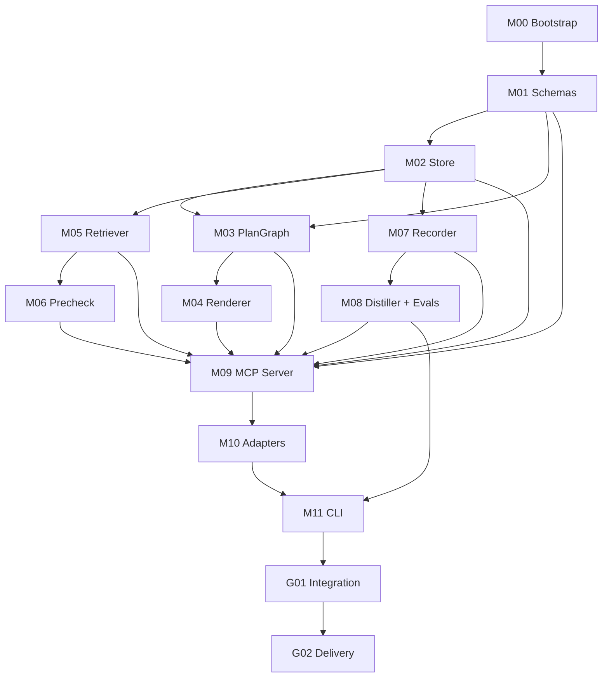

# V0 Module Sequence

## Dependency graph

## Parallelism

After M01 and M02 are done, M03/M05/M07 can be done by separate agents. M09 must wait until M01-M08 are done.

## Revision policy

If a downstream module discovers a schema gap, it must:

1. Write a blocker or revision request against M01.
2. Add a proposed schema diff in its handoff.
3. Not patch schemas ad hoc without tests.
